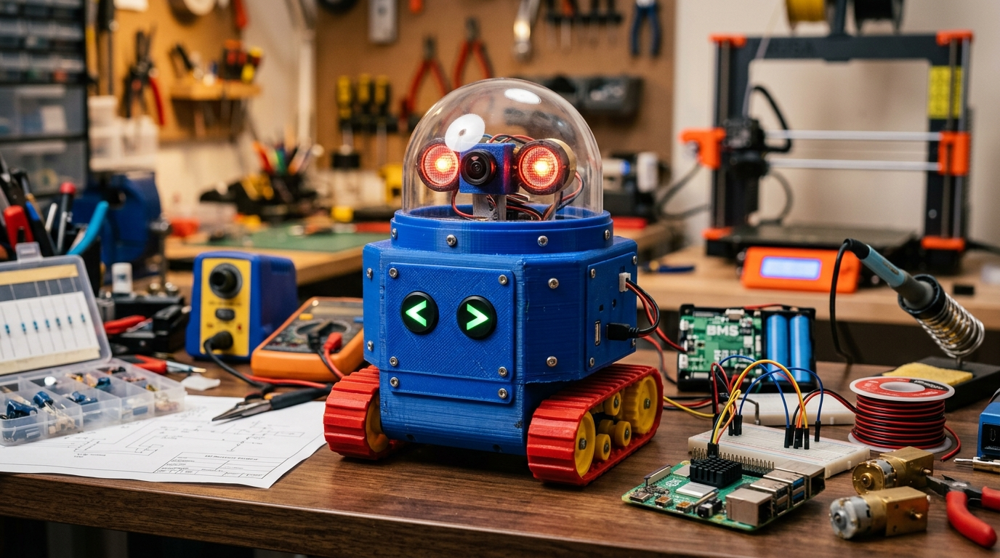

# Andy's Coming! — Real-Life Toy Story AI Robot

A physical, tangible hardware and artificial intelligence maker project bringing the holy grail feature of *Toy Story* to reality: a companion robot that secretly has a life of its own on your desk, but **instantly goes limp and plays dead** whenever a human enters the room or someone shouts *"Andy's coming!"*.



---

## 1. The Core Behavioral States

```
[ ALIVE MODE ]                                  [ PLAY DEAD MODE ]
• Roams desk on tank treads                     • SG90 servo PWM cuts to 0 (head flops limp)
• Scans items via Camera Module 3               • Motor drive pins ground immediately
• Quips in 90s retro toy voice (Piper)          • Glowing red eye LEDs cut to pitch black
• Runs local Gemma LLM on Raspberry Pi 5        • Instant speech cutoff (<50ms)
• Protests when picked up by handle             • Inert until green chest arrow is pressed
```

---

## 2. Interactive Web Visualizer & 3D Builder

This repository contains a zero-dependency, pure HTML5/WebGL interactive builder and simulator app:

- **3D Exploded Assembly**: Procedural Three.js 3D viewport with an exploded view slider (0% compact to 100% full internal component stack).
- **Verified 25-Part BOM**: Itemized parts catalog with real-time budget tracking, sourcing links, and acquisition checklists.
- **Interactive Wiring Schematic & Pi 5 Pinout**: Full 40-pin GPIO pinout map with conflict detection (I2S audio bit clock isolated from PWM servo).
- **Real-Time Sensor Simulator**: Interactive behavioral state machine testing wake words, footsteps, light changes, and gyro shakes with Web Audio synthesizer sound effects.
- **Parametric OpenSCAD Models**: Ready-to-slice 3D models for torso, chassis, dome neck, and chest buttons.
- **Complete Autonomous Python Controller**: Production-ready script running multi-threaded sensor loops, openWakeWord, and local Gemma inference.

### Running Locally

```bash
# Clone the repository
git clone https://github.com/atticusgoogle/andy-robot.git
cd andy-robot

# Serve with any static HTTP server (e.g. Python)
python3 -m http.server 8090
```
Open `http://localhost:8090` in your web browser.

### Deploying to GitHub Pages

1. In your GitHub repository settings, navigate to **Pages**.
2. Under **Build and deployment > Source**, select **Deploy from a branch**.
3. Choose the `main` branch and `/ (root)` folder, then click **Save**.
4. Your interactive builder will be live globally in seconds!

---

## 3. Verified Bill of Materials (BOM) — Total: $249.00

| # | Component | Model / Part | Price (USD) | Category | Role / Notes |
|---|---|---|---|---|---|
| 1 | Microcomputer | Raspberry Pi 5 (8GB RAM) | $80.00 | Compute | Mandatory 8GB for local 4-bit Gemma inference + openWakeWord in RAM |
| 2 | Active Cooling | Raspberry Pi Active Cooler | $5.00 | Cooling | Aluminum heatsink + PWM fan; prevents thermal throttling |
| 3 | Storage | 64GB/128GB MicroSD (A2/V30) | $15.00 | Storage | High random IOPS for fast model loading |
| 4 | Camera | Pi Camera Module 3 (Wide 120°) | $35.00 | Vision | Wide-angle desk vision; autofocus |
| 5 | Microphone | INMP441 I2S MEMS Board | $3.50 | Audio In | Digital I2S interface; background acoustic threshold detection |
| 6 | Audio Amp | MAX98357A I2S Mono 3W Amp | $4.00 | Audio Out | Direct digital audio out from GPIO pins (BCLK, LRCLK, DIN) |
| 7 | Speaker | 4Ω 3W 40mm Enclosed Speaker | $4.00 | Audio Out | Sealed rear cavity yields authentic tinny 90s plastic toy sound |
| 8 | Head Servo | SG90 9g Analog Micro Servo | $3.00 | Actuator | Analog servo required; 0% PWM duty cycle drops torque for limp flop |
| 9 | Gearmotors | 2× N20 Micro Metal Gearmotors (6V 100RPM) | $8.00 | Locomotion | High-torque micro metal gearboxes for tank crawler base |
| 10 | Motor Driver | DRV8833 Dual H-Bridge Module | $3.00 | Locomotion | Low RDS(on) MOSFETs; VM wired to raw 7.4V battery |
| 11 | Track Kit | Mini Rubber Track & Wheel Kit | $14.00 | Locomotion | Continuous rubber tracks + 6 yellow wheels (drive sprockets & idlers) |
| 12 | IMU Sensor | MPU6050 6-DOF Sensor (I2C) | $3.00 | Sensors | Detects handle lift, table taps, shakes, or flips |
| 13 | Facial LEDs | 2× 10mm Diffused Red LEDs + 220Ω | $1.50 | Facial LEDs | Vintage glowing robot eyes on GPIO 17; instant black on play dead |
| 14 | Chest Switches | 2× 6×6mm Panel Tactile Switches | $0.50 | Chest UI | Mounted behind green chest arrow buttons; click to wake/revive |
| 15 | Battery Cells | 2× 18650 High-Discharge (Molicel P28A) | $14.00 | Power | 2S 7.4V nominal; high discharge prevents voltage sag brownouts |
| 16 | Battery Protection| 2S 10A–15A Li-ion BMS Board | $3.00 | Power | Overcharge, low-voltage cutoff, and short-circuit protection |
| 17 | DC-DC Regulator | 5V 5A High-Efficiency Buck Converter | $5.00 | Power | Steps down 7.4V to calibrated 5.10V rail for Pi 5 Pins 2/4 and SG90 |
| 18 | Master Switch | Mini SPST Rocker Switch (3A+) | $1.00 | Power | Physical master kill switch mounted to rear chassis |
| 19 | Head Dome | 80mm Clear Acrylic Sphere Half | $3.00 | Aesthetic | Clear canopy protecting camera lens and facial LEDs |
| 20 | 3D Filament | PLA (Royal Blue, Red, Yellow, Green)| $25.00 | 3D Printing | Multi-color retro palette matching original toy aesthetics |
| 21 | Hardware Kit | M2.5 & M2 Standoff + Screw Assortment | $8.00 | Fasteners | Brass standoffs and screws for PCB and chassis mounting |
| 22 | CSI Cable | 22-pin to 15-pin Mini CSI Cable (200mm)| $3.50 | Vision Cable| Adapts Pi 5 mini 22-pin CSI pitch to Camera 3 |
| 23 | Battery Holder | 2S 18650 Holder with Leads | $2.00 | Power Safety| Eliminates dangerous direct soldering to lithium cells |
| 24 | USB-C Charger | Type-C 2S 8.4V Boost Charger Board | $2.50 | Recharging | Allows recharging battery pack via USB-C |
| 25 | Wires | DuPont Jumper Wires (40-Pin F-F / F-M) | $2.50 | Prototyping | GPIO pin-to-sensor interconnections |
| **Total** | | | **$249.00** | | Complete 25-part hardware BOM |

---

## 4. Raspberry Pi 5 40-Pin GPIO Pinout Map

```
+------------------------------------+------------------------------------+
| 3.3V Power (Pin 1)                 | 5V DC Power Input (Pin 2)          |
| GPIO 2 / SDA1 (MPU6050 Pin 3)      | 5V DC Power Input (Pin 4)          |
| GPIO 3 / SCL1 (MPU6050 Pin 5)      | Ground (GND) (Pin 6)               |
| GPIO 4 (Spare / Sentry Pin 7)      | GPIO 14 / UART TXD (Pin 8)         |
| Ground (GND) (Pin 9)               | GPIO 15 / UART RXD (Pin 10)        |
| GPIO 17 (Red Eye LEDs Pin 11)      | GPIO 18 / I2S BCLK (Pin 12)        |
| GPIO 27 (DRV8833 IN1 Pin 13)       | Ground (GND) (Pin 14)              |
| GPIO 22 (DRV8833 IN2 Pin 15)       | GPIO 23 (DRV8833 IN3 Pin 16)       |
| 3.3V Power (Pin 17)                | GPIO 24 (DRV8833 IN4 Pin 18)       |
| GPIO 10 (SPI MOSI Pin 19)          | Ground (GND) (Pin 20)              |
| GPIO 9 (SPI MISO Pin 21)           | GPIO 25 (Chest Revive Button 22)   |
| GPIO 11 (SPI SCLK Pin 23)          | GPIO 8 (SPI CE0 Pin 24)            |
| Ground (GND) (Pin 25)              | GPIO 7 (SPI CE1 Pin 26)            |
| GPIO 0 / ID_SD (EEPROM Pin 27)     | GPIO 1 / ID_SC (EEPROM Pin 28)     |
| GPIO 5 (Chest Mode Button Pin 29)  | Ground (GND) (Pin 30)              |
| GPIO 6 (DRV8833 Fault Pin 31)      | GPIO 12 / PWM0 (SG90 Servo Pin 32) |
| GPIO 13 (DRV8833 Sleep Pin 33)     | Ground (GND) (Pin 34)              |
| GPIO 19 / I2S LRCLK (Pin 35)       | GPIO 16 (Spare GPIO Pin 36)        |
| GPIO 26 (Spare GPIO Pin 37)        | GPIO 20 / I2S DIN (Pin 38)         |
| Ground (GND) (Pin 39)              | GPIO 21 / I2S DOUT (Pin 40)        |
+------------------------------------+------------------------------------+
```

> **Pinout Conflict Avoided**: SG90 servo PWM is routed to **GPIO 12 (Physical Pin 32)**, keeping **GPIO 18 (Physical Pin 12)** dedicated to the clean I2S Bit Clock (BCLK) shared between the INMP441 microphone and MAX98357A amplifier.

---

## 5. Software & Autonomous Controller

The autonomous controller lives at [`scripts/andy_robot_autonomous.py`](scripts/andy_robot_autonomous.py).

### Key Features
1. **Background openWakeWord Thread**: Real-time listening for *"Andy's coming!"* model inference.
2. **Instant Emergency Cut (<50ms)**:
   ```python
   def emergency_play_dead(trigger_reason):
       # 1. Kill speech instantly
       os.system("pkill -9 aplay > /dev/null 2>&1")
       # 2. Halt motors
       stop_motors()
       # 3. Kill eye LEDs
       GPIO.output(LED_PIN, GPIO.LOW)
       # 4. Cut servo torque: duty cycle 0 drops holding torque to 0 N·cm
       neck_servo.ChangeDutyCycle(0)
   ```
3. **Local Gemma LLM Inference**: Quantized 4-bit Gemma model loaded via `llama.cpp` for offline toy quips.
4. **Natural Speech via Piper TTS**: 22.05 kHz low-latency speech synthesis routed directly to the I2S speaker.
5. **MPU6050 IMU Monitoring**: Continuous orientation and jerk tracking to detect when Andy picks the robot up or knocks it over.

### Systemd Auto-Start Service

To run automatically when the robot powers on:
```bash
sudo cp scripts/andy-robot.service /etc/systemd/system/
sudo systemctl daemon-reload
sudo systemctl enable andy-robot.service
sudo systemctl start andy-robot.service
```

---

## 6. 3D Printable Chassis (OpenSCAD)

The parametric model is located at [`cad/andy_robot_chassis.scad`](cad/andy_robot_chassis.scad).

### Recommended Slicing Settings:
- **Material**: PLA (Royal Blue, Signal Red, Bright Yellow, Grass Green)
- **Layer Height**: 0.20 mm
- **Infill**: 20% Gyroid (Lower Chassis: 35% for motor rigidity)
- **Wall Loops / Perimeters**: 3 (Torso), 4 (Base)
- **Supports**: Tree supports (organic) for chest camera aperture only

---

## 7. License

MIT License. Open-source for hobbyists, makers, and retro toy enthusiasts!
